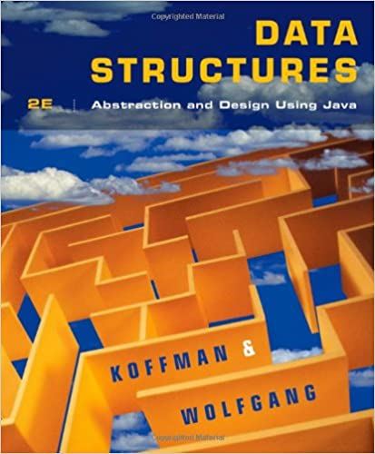

# 자료구조

자료구조 정리는 [Data Structures: Abstraction and Design Using Java 2nd Edition](https://www.amazon.com/Data-Structures-Abstraction-Design-Using/dp/0470128704/ref=sr_1_3?dchild=1&keywords=koffman+wolfgang&qid=1602565152&sr=8-3) 를 바탕으로 정리한 내용입니다.

[1. List](https://www.notion.so/1-List-f21365d91e4e4de3aeccc82a6a837cfc)

[2. Stack](https://www.notion.so/2-Stack-d12c6b0e92ce404683ca194813c94656)

[3. Queue](https://www.notion.so/3-Queue-a959345e02584dc78c6b31cd9b96e709)

[4. Recursion](https://www.notion.so/4-Recursion-5d72ac40c0da4db6a54c244cd98abfcf)

[5. Tree](/Data_Structure/Tree.md)

[6. Set](https://www.notion.so/6-Set-9fbd3aaab6724e5b972957040c75f3d8)

[7. Map](https://www.notion.so/7-Map-4ed84dc2071e49e2b57c610dd7972c18)

[8. Sorting](https://www.notion.so/8-Sorting-d8b202f241d0417292ab635223b9c0ee)

[9. Self-Balancing Search Tree](https://www.notion.so/9-Self-Balancing-Search-Tree-aef056f6dec34b97b6ad90e3ae877926)

[10.Graph](https://www.notion.so/10-Graph-5ea824cdca824c85a9989d0e91f78fb2)