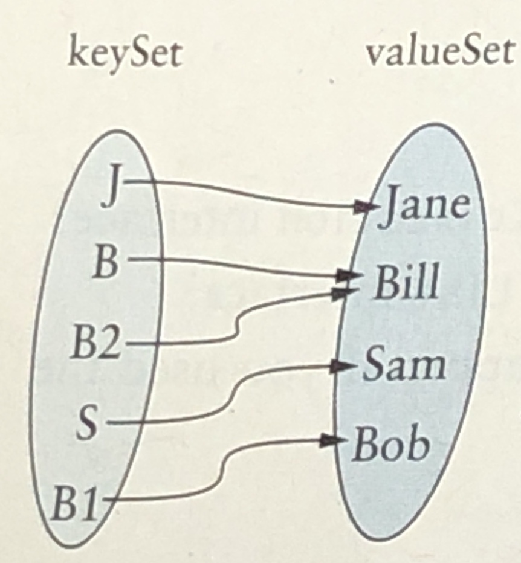
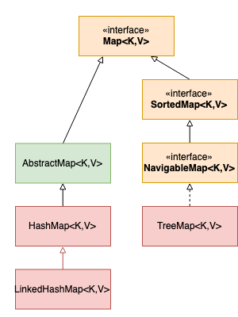

# 7. Map

## MAP 이란?

맵도 Set과의 연관성은 있다.  Map의 경우 key로 구성된 요소와 value로 구성된 요소가 쌍을 이룬 Set이라고 생각하면 더 쉽다. 

물론 전제 조건으로 Key는 유일해야 하고, value는 유일하지 않아도 된다. key를 마치 Set의 원소처럼 쓴다.

그러면 대략 이렇게도 생각할 수 있다. 키에 대해서 집합과  value에 대한 집합이 mapping되어 있는 듯한 모습으로 구성될 수도 있다는 생각을 할 수 있다.

이렇게 된다면, 수학적 집합 전문용어로 many to one mapping 다대일 관계라고 할 수 있다. 

## Map의 계층 구조

자바에서 Map은 Collection에 포함되어있지 않지만, Set과 비슷한 계층형 구조를 가지고 있다.