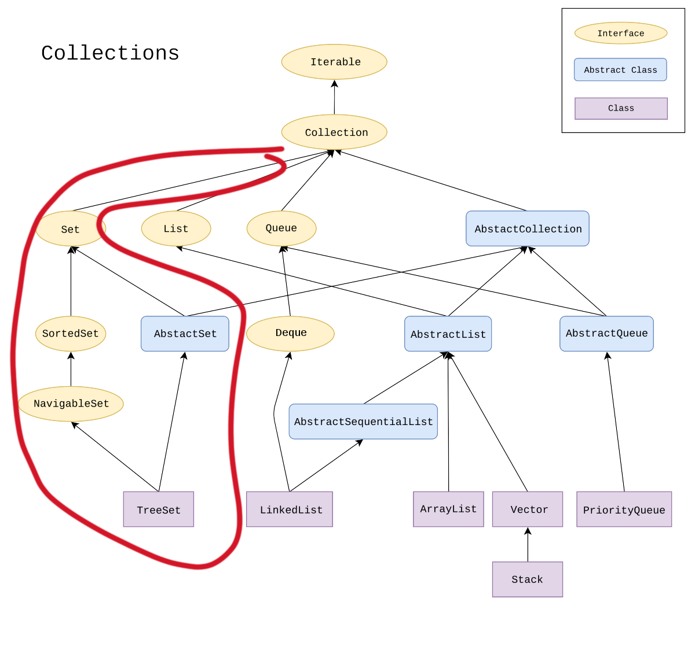

# 6. Set

Set과 Set의 인터페이스에 대해서 알아보자

## SET이란?

JAVA의 자료구조 프레임워크인 Collection에 포함되어 있는 객체이다.

Set 자체는 엄청 많은 형식의 Collection interface에 거쳐 거쳐 만들어져 있다. 계층형 구조에 의해서 다음과 같이 나눌 수 있는데, 

interface : Set, SortedSet, NavigableSet

abstract class: AbstractSet

실제 클래스: TreeSet, HashSet, ConcurrentSkipListSet

이렇게 구성되어있다고 할 수 있다.

JAVA  API 에서는 SET을 다음과 같이 정의한다.

중복되는 요소가 없는 것을 포함하는 Collection이다. 더 형식적으로 Sets는 e1과 e2가 예를 들어서 e1.equals(e2) 와 같이 전혀 접점이 없는 요소들을 포함하는 것이다.

한국어 뿐만 아니라 영어에서도 Set은 집합 즉, 수학적 용어와 겹치기 때문에, 그 개념을 어느정도 포함하고 있기도 하다. 그래서 우리는 이런 집합적 연산을 Set의 메소드에서도 찾아 볼 수가 있다. 

SET의 집합 연산을 사용하기 위해서는 집합 연산을 하려는 파라미터도 SET이여야 한다.

1. 합집합: addAll(Collection<E> coll) → 합집합과  같은 기능을 한다. 
2. 포함관계: contains() → 이 집합에 원소가 포함 됬는지? (Set membership )
3. 부분집합: containsALL(coll) → **이 coll의 부분집합이라면, ⇒ true 반환**
4. 차집합: removeALL(coll) → coll에 포함되어있는 것을 집합에서 뺀다. coll이 집합이면 차집합 연산
5. 교집합: retainAll(coll) → coll에 포함되어있는 것과 같은걸 모아서 교집합화